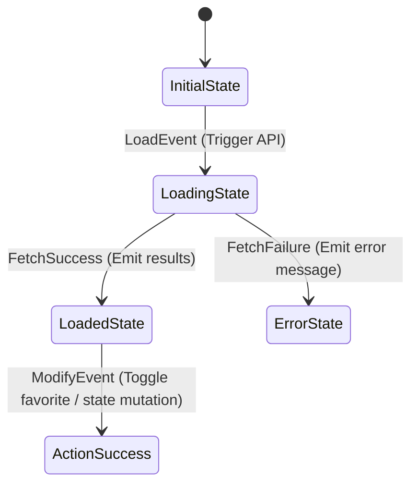

# Recipely - Technical Project Documentation

Recipely is a premium, feature-rich recipe discovering and cooking companion mobile application built with Flutter. This document describes the application architecture, routing layout, state management, database schema, and custom premium user interface components.

---

## 1. Directory & Folder Structure

Recipely utilizes a modular, feature-first design structure for ease of scalability, separation of concerns, and clean interface maintainability.

```
lib/
├── env.dart                  # Loaded environment credentials (Supabase config)
├── main.dart                 # Application entrypoint & dependency setup
├── app.dart                  # Core MaterialApp configuration and wrapper context
├── l10n/                     # Internationalization translation definitions
│   └── app_localizations.dart
├── router/                   # Type-safe GoRouter navigation controllers
│   ├── app_router.dart
│   ├── routes.dart
│   └── routes.g.dart
├── modules/                  # Feature-first modules containing UI and Business Logic
│   ├── ai_generator/         # Ingredient-driven recipe generation using AI models
│   ├── auth/                 # Sign In, Sign Up, and session flows
│   ├── home/                 # Main discovery feed, hero banner, category slider
│   ├── search/               # Search grid, recent searches, diet/time filter sliders
│   ├── favorites/            # Favorites list grid, custom bottom sorting menu
│   ├── recipe_detail/        # Cooking step-by-step guides, servings adjuster
│   ├── profile/              # User metrics, custom avatar upload, initials check
│   └── settings/             # User settings, password changes, terms & FAQs
└── shared/                   # Shared modules, shared widgets, and core utilities
    ├── core/                 # Typography, HSL color palettes, dimension guidelines
    ├── data/                 # Common databases, model parsers, repositories
    │   ├── datasources/      # Remote APIs and data services (SupabaseClient)
    │   ├── models/           # Data transfer objects (RecipeModel, UserProfileModel)
    │   └── repositories/     # Offline/online repository layer interfaces
    ├── di/                   # GetIt dependency injection registry
    ├── services/             # Cache, Token storage, connectivity watchers
    └── widgets/              # Reusable premium buttons, shimmer cards, avatars
```

---

## 2. State Management (BLoC)

Recipely adopts standard BLoC patterns via `flutter_bloc` to maintain deterministic, testable, and reactive state transitions.



### Module Implementations
- **HomeModule (`HomeBloc`):** Manages discovery feeds, active category selections, featured recipes, and trending recipe list state.
- **SearchModule (`SearchBloc`):** Watches active text query streams, filters queries locally based on selected tags (dietary preferences, preparation speed, difficulty metrics), and manages recent search lists.
- **FavoritesModule (`FavoritesBloc`):** Loads saved recipes and executes local sorting logic (A-Z, Z-A, Latest, Oldest) before rendering.
- **RecipeDetailModule (`RecipeDetailBloc`):** Coordinates checked ingredients checklists, changes between steps tabs, and coordinates cooking guide overlays.
- **ProfileModule (`ProfileBloc`):** Fetches total recipes cooked, bookmarks count, and handles image avatar uploads.

---

## 3. Type-Safe Routing (GoRouter Builder)

Routing is designed using GoRouter with code generation (`go_router_builder`) to enforce type-safety and compile-time path verification.

- **Config File:** [app_router.dart](file:///d:/New%20folder/receipe_flutter/lib/router/app_router.dart) registers the navigation key and hooks up generated routes.
- **Routes Declaration:** [routes.dart](file:///d:/New%20folder/receipe_flutter/lib/router/routes.dart) defines path locations:
  - `/` -> `SplashRoute` (Initial landing splash screen)
  - `/onboarding` -> `OnboardingRoute`
  - `/login` -> `LoginRoute`
  - `/signup` -> `SignUpRoute`
  - `/home` -> `HomeRoute` (Entry to the bottom navigation tab layout)
  - `/recipe/:recipeId` -> `RecipeDetailRoute` (Loads details screen parameter-safely)

---

## 4. Backend & Database Integration (Supabase)

Recipely integrates with Supabase for user sessions, database queries, and storage bucket asset management.

### Database Tables Schema

```sql
-- Profiles Table
CREATE TABLE public.profiles (
    id         UUID        PRIMARY KEY REFERENCES auth.users(id) ON DELETE CASCADE,
    name       TEXT        NOT NULL,
    chef_level TEXT        NOT NULL DEFAULT 'Home Chef',
    avatar_url TEXT        NOT NULL DEFAULT 'user-avatars/default.png',
    created_at TIMESTAMPTZ NOT NULL DEFAULT now()
);

-- Recipes Table
CREATE TABLE public.recipes (
    id          UUID        PRIMARY KEY DEFAULT gen_random_uuid(),
    title       TEXT        NOT NULL,
    description TEXT        NOT NULL,
    rating      NUMERIC     NOT NULL DEFAULT 0.0,
    reviews     INT         NOT NULL DEFAULT 0,
    cook_time   TEXT        NOT NULL,
    calories    TEXT        NOT NULL,
    servings    TEXT        NOT NULL,
    image_url   TEXT        NOT NULL,
    difficulty  TEXT        NOT NULL,
    is_featured BOOLEAN     NOT NULL DEFAULT false,
    is_trending BOOLEAN     NOT NULL DEFAULT false,
    created_at  TIMESTAMPTZ NOT NULL DEFAULT now()
);

-- Favorites Junction Table
CREATE TABLE public.favorites (
    user_id    UUID        NOT NULL REFERENCES public.profiles(id) ON DELETE CASCADE,
    recipe_id  UUID        NOT NULL REFERENCES public.recipes(id)  ON DELETE CASCADE,
    created_at TIMESTAMPTZ NOT NULL DEFAULT now(),
    PRIMARY KEY (user_id, recipe_id)
);
```

### Supabase Storage
- **Bucket:** `user-avatars`
- **Policies:** Row-level security (RLS) is active. Authenticated users are permitted to upload and replace custom photos matching their exact `auth.uid()`.

---

## 5. UI Features & Design Patterns

### Skeleton Shimmer Loading
To deliver a premium experience, loading spinners are replaced by layout skeleton shimmers powered by `Shimmer`:
- **Home Shimmer (`_buildHomeShimmer`):** Renders placeholders matching category lists, featured banners, and trending card cards.
- **Search Shimmer (`_buildShimmerGrid`):** Displays outline placeholders of recipe items while search filters are processed.
- **Recipe Detail Shimmer (`_buildDetailShimmer`):** Creates skeleton shapes for the header photo, descriptive statistics boxes, and steps tab lists.
- **Profile Shimmer (`_buildProfileShimmer`):** Renders avatar circles, score boxes, and actions cards.

### Smart Connectivity Wrapper
`ConnectivityWrapper` watches network status changes globally:
- **Offline Banner:** Shows a warning amber (`0xFFD97706`) banner with icon indicators when internet goes off.
- **Online Recovery Banner:** Shows a green (`0xFF2E7D32`) `"Back online"` notification only if the device has transitioned from offline. On fresh app launch, it remains hidden to prevent screen clutter.

### Custom Global SnackBar Theme
Configured inside [app_theme.dart](file:///d:/New%20folder/receipe_flutter/lib/shared/core/theme/app_theme.dart):
```dart
snackBarTheme: SnackBarThemeData(
  backgroundColor: const Color(0xFFD97706), // Warning amber
  behavior: SnackBarBehavior.floating,
  shape: RoundedRectangleBorder(
    borderRadius: BorderRadius.circular(16),
  ),
  contentTextStyle: GoogleFonts.poppins(color: Colors.white, fontSize: 13.5),
)
```
This forces all snackbar notifications in the app (from sign up to AI recipe generations) to display as floating rounded pills.
